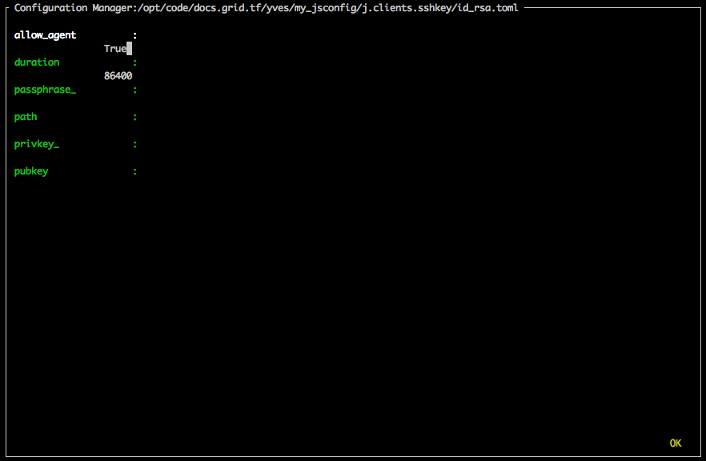
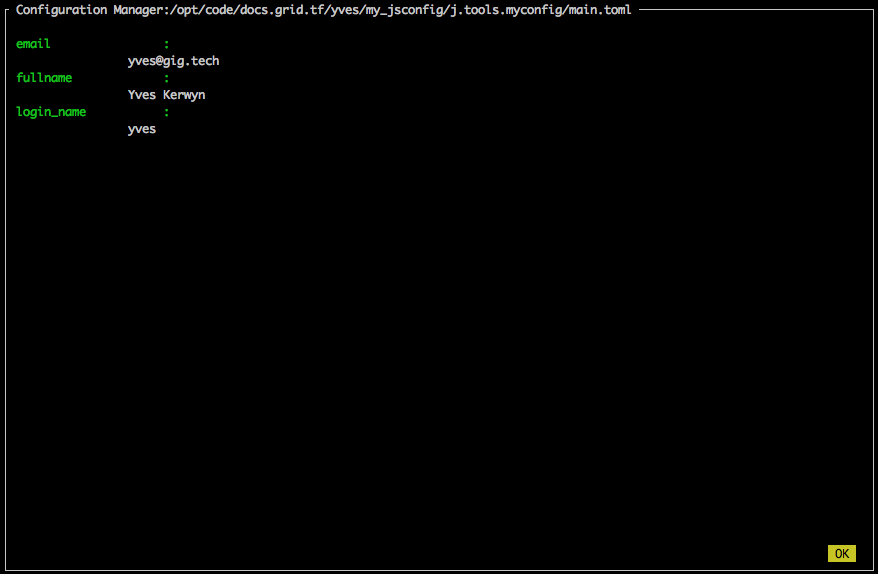
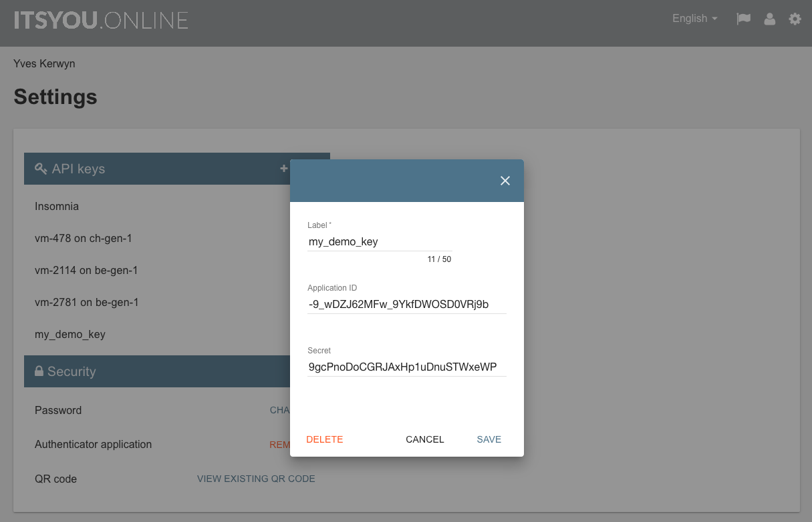
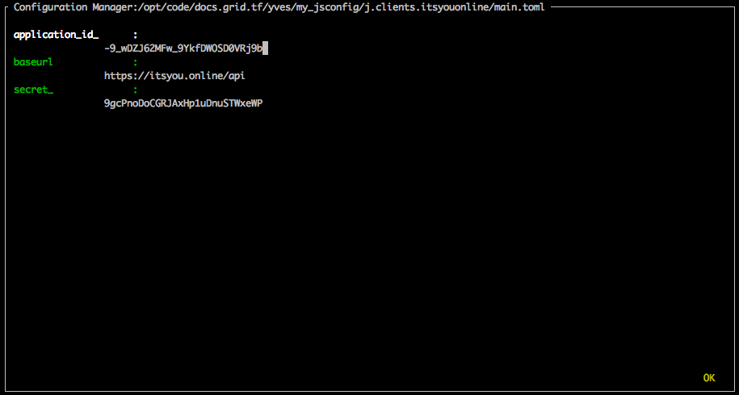

# Getting started with the Config Manager 

See: https://github.com/Jumpscale/core9/blob/development/docs/config/configmanager.md


## Initialize the config manager

Steps:
- [Create the SSH key](#ssh-key)
- [Create Git repository](#git-repo)
- [Initialize the config manager](#init)
- [Create a config instance for ItsYou.online](#iyo)
- [Next steps](#next)


<a id="ssh-key"></a>

### Create the SSH key

The JumpScale config manager will encrypt all secret configuration data with an SSH private key of choice.

In case you don't have any SSH key yet, create it from the command line, here with an empty passphrase:
```bash
export JS_CONFIG_SSHKEY_NAME="~/.ssh/jsconfig_key"
ssh-keygen -t rsa -f ~/.ssh/$JS_CONFIG_SSHKEY_NAME -P ''
```

Or using JumpScale:
```python
import os
ssh_key_name = os.environ["JS_CONFIG_SSHKEY_NAME"]
j.tools.prefab.local.system.ssh.keygen(user='root', keytype='rsa', name=ssh_key_name)
```


<a id="git-repo"></a>

### Create Git repository

Create a new Git repository under `j.dirs.CODEDIR`, which typically is `/opt/code`.

We recommend to create the repository in the following path: `$GIT_SERVER/$GIT_ACCOUNT/$REPO_NAME`:
```bash
GIT_SERVER="docs.grid.tf"
GIT_ACCOUNT="yves"
REPO_NAME="jsconfig"
JS_CONFIG_REPO_DIR="/opt/code/$GIT_SERVER/$GIT_ACCOUNT/$REPO_NAME"
mkdir -p $JS_CONFIG_REPO_DIR
cd $JS_CONFIG_REPO_DIR
git init #optional
```

Or if first create a private Git repository on your Git server, and then execute:
```bash
GIT_SERVER="docs.grid.tf"
GIT_ACCOUNT="yves"
REPO_NAME="jsconfig"
JS_CONFIG_REPO_DIR="/opt/code/$GIT_SERVER/$GIT_ACCOUNT/$REPO_NAME"
git clone ssh://git@docs.grid.tf:7022/yves/jsconfig.git
touch README.md
git add .
git commit -m "first commit"
git push
```

<a id="init"></a>

### Initialize the config manager

In order to mark the above created Git repository as your configuration repository execute:
```bash
js9_config init --path $JS_CONFIG_REPO_DIR --key $JS_CONFIG_SSHKEY_PATH
``` 

Or from the interactive shell, first prepare the configuration:
```python
git_server = "docs.grid.tf"
git_account = "yves"
repo_name = "jsconfig"

jsconfig = {}
jsconfig["email"] = "yves@gig.tech"
jsconfig["login_name"] = "yves"
jsconfig["fullname"] = "Yves Kerwyn"
```

Then for an existing SSH key, in this case for `~/.ssh/id_rsa`, execute:
```python
import os
sshkey_path = os.path.expanduser(path='~/.ssh/id_rsa')
config_path = "{}/{}/{}/{}".format(j.dirs.CODEDIR, git_server, git_account, repo_name)


j.tools.configmanager.init(data=jsconfig, silent=True, configpath=config_path, keypath=sshkey_path)
```

Or for a new SSH key:
```python
sshkey_name = "jsconfig_key"
sshkey_path = "/root/.ssh/{}".format(sshkey_name)
sshkey_client = j.clients.sshkey.key_generate(path=sshkey_path, passphrase='hello')


config_path = "{}/{}/{}/{}".format(j.dirs.CODEDIR, git_server, git_account, repo_name)

j.tools.configmanager.init(data=jsconfig, silent=False, configpath=config_path, keypath=sshkey_path)
```

This will pop up two interactive screens:
- the first one to collect configuration data for `j.clients.sshkey`
- the second one to collect configuration data for `j.tools.myconfig`

The first one should not be filled out, since all data come from the `$JS_CONFIG_SSHKEY_PATH` you passed:




In the second you can specify your e-mail address, full name and your (ItsYou.online or other) username:




As a result two configuration files will get created:
- `$JS_CONFIG_REPO_DIR/j.clients.sshkey/id_rsa.toml`
- `$JS_CONFIG_REPO_DIR/j.tools.myconfig/main.toml`


In order to check whether there is already a config repository:
```python
j.tools.configmanager._findConfigRepo()
```

Also see the `~/js9host/cfg/jumpscale9.toml`: 
```toml
[myconfig]
sshkeyname = "id_rsa"
path = "/tmp/yveskerwyn"
giturl = ""
```

Also to check:
```python
j.tools.myconfig
```

<a id="iyo"></a>

## Create a config instance for ItsYou.online

In order to create a configuration instance for an ItsYou.online user or organization, you need an API key for that user or organization:



The API key consists of two parts: an `application ID` and a `secret`. 

In the interactive shell copy the values of the ``application ID` and `secret` into a dictionary: 
```python
app_id = ""
secret = ""
iyo_cfg = {
    "application_id_": app_id,
    "secret_": secret
}
```

In order to create the config instance for this ItsYou.online user execute:
```python
cfg_manager = j.tools.configmanager
iyo_location  = "j.clients.itsyouonline"
cfg_manager..configure(location=iyo_location, instance="main", data=iyo_cfg, interactive=True)
```

This will bring up the config manager interactive screen:


The same can be achieve from the command line using `js9_config configure` as follows:
```bash
js9_config configure -l j.clients.itsyouonline -i main
```

As a result you will now have an ItsYou.online config instance:
```python
j.tools.configmanager.list(location="j.clients.itsyouonline")
```

In order to get it:
```python
iyo_config_instance = j.tools.configmanager.get(location="j.clients.itsyouonline", instance="main")
```

This allows you to update any of the configuration data as follows:
```python
iyo_config_instance.data_set(key="application_id_", val="<new_vale_here>", save=True)
```

Through the ItsYou.online client you can use the configuration instance:
```python
iyo_client = j.clients.itsyouonline.get(instance="main")
```

A typical usage scenario is getting a JSON web token (JWT), asserting that the user for which the API key was created is member of a specified ItsYou.online organization:
```python
iyo_organization = "training-org-name"
iyo_client = j.clients.itsyouonline.get(instance="main")
memberof_scope = "user:memberof:{}".format(iyo_organization)
jwt = iyo_client.jwt_get(scope=memberof_scope)
```

<a id="next"></a>
## Next steps

Next you will want to check:
- [Zero-OS client](14-zero-os_client.md)
- [Getting started with Zero-Robot](12-zero-robot.md)
- [Interacting with OpenvCloud](13-openvcloud.md)