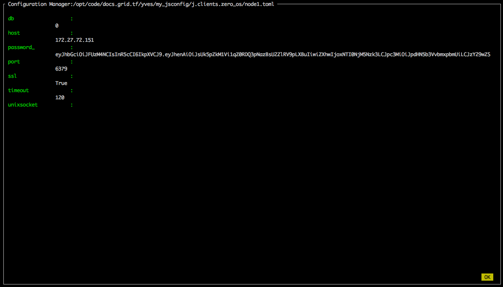
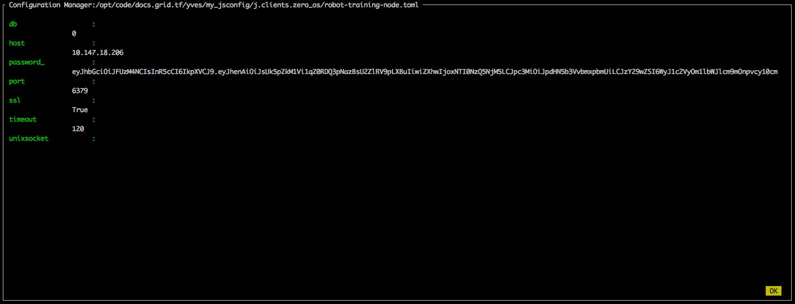

# Using the JumpScale client for Zero-OS

Customer iPXE
https://bootstrap.gig.tech/ipxe/development/17d709436c5bc232/organization=zos-training-org%20development

JumpScale bootstrap VM:
- https://be-gen-1.demo.greenitglobe.com/CBGrid/Virtual%20Machine?id=2841
- `ssh root@195.134.212.38 -p7722`


Install and start ZeroTier using the Prefab module for JumpScale:
```python
local_executor = j.tools.executor.local_get()
local_prefab = j.tools.prefab.get(local_executor)
#local_prefab = j.tools.prefab.local
local_prefab.network.zerotier.install()
local_prefab.network.zerotier.start()
```

Join the ZeroTier network from JumpScale:
```python
zt_network_id = "17d709436c5bc232"
local_prefab.network.zerotier.network_join(network_id=zt_network_id)
```

Get JWT, asserting that I'm member of `zos-training-org`:
```python
iyo_organization = "zos-training-org"
iyo_client = j.clients.itsyouonline.get(instance="main")
memberof_scope = "user:memberof:{}".format(iyo_organization)
jwt = iyo_client.jwt_get(scope=memberof_scope)
```

List all nodes:
```python
j.clients.zero_os.list()
```

Create new client for the newly deployed Zero-OS node:
```python
zos_cfg = {
   "host": "10.147.18.206",
   "port": 6379,
   "password_": jwt
}

cfg_manager = j.tools.configmanager
zos_location  = "j.clients.zero_os"
zos_cfg_instance_name = "robot-training-node"
zos_cfg_instance = cfg_manager.configure(location=zos_location, instance=zos_cfg_instance_name, data=zos_cfg, interactive=True)
zos_client = j.clients.zero_os.get(instance=zos_cfg_instance_name)
# zos_client = j.clients.zero_os.get(instance="node-robot-training-node", data=zos_cfg)
```




Get the `node` interface of the Zero-OS node:
```python
node = j.clients.zero_os.sal.get_node(instance=zos_cfg_instance_name)
```

> Not the difference between `zos_cfg_instance`, `zos_client` and `node` by comparing the methods in the interactive shell.


Create new container using the JumpScale sandbox flist:
```python
flist = 'https://hub.gig.tech/abdelrahman_hussein_1/js9_sandbox_full.flist'

js9_sandbox_container = node.containers.create(name='js9_sandbox',
                                          flist=flist,                                              
                                          hostname='js',
                                          nics=[{"type": "default"}],
                                          ports={2200: 22})
```

Test the container by executing a bash command:
```python
js9_sandbox_container.client.bash(script='. /env.sh; js9 "print(\'works in JS9!\')"').get()
```

Four steps now to enable SSH access to the container:
- Create the SSH host keys and start the daemon
- Enable root access
- Open port 2200 on the node
- Start the daemon

Create the SSH host keys and start the daemon:
```python
js9_sandbox_container.client.system(command='mkdir -p /etc/ssh/')
js9_sandbox_container.client.system(command='mkdir -p /var/run/sshd')
js9_sandbox_container.client.system(command='ssh-keygen -A')    
js9_sandbox_container.client.system(command='sshd -D')
```

Enable root access:
```python
js9_sandbox_container.client.bash(script="sudo sed -i 's/prohibit-password/without-password/' /etc/ssh/sshd_config").get()
```

Open port 2200 on the node:
```python
nft = node.client.nft
nft.open_port(2200)
```

Start the deamon:
```python
job = js9_sandbox_container.client.system(command='sshd -D')
job.running
job.get()

```

In case you need to restart the SSH daemon, first find the PID of sshd and that kill the process, and restart:
```python
js9_sandbox_container.client.process.list()
js9_sandbox_container.client.process.kill(pid=120)
job = my_container.client.system(command='sshd')
job.running
job.get()
```

Create a new SSH key:
```python
import os
sshkey_name = "example_rsa"
sshkey_path = os.path.expanduser("~/.ssh/{}".format(sshkey_name))

my_new_sshkey_client = j.clients.sshkey.key_generate(path=sshkey_path, passphrase='hello')
```

Check the result, both on disk as in the configuration manager:
```
!ls ~/.ssh
j.tools.configmanager.list("j.clients.sshkey")
```

Note that when checking `j.clients.sshkey.list()`, you will not see the config instance for the new SSH key, because `j.clients.sshkey.list()` only lists the SSH keys that are loaded by the SSH agent:
```python
j.clients.sshkey.list()
```

Alternatively use `j.tools.prefab.local.system.ssh.keygen()` which will not create a config instance, so you need to create it explicitly: 
```python
j.tools.prefab.local.system.ssh.keygen(user='root', keytype='rsa', name=sshkey_name)
my_new_sshkey_client =  j.clients.sshkey.get(instance=sshkey_name, data=dict(path=sshkey_path))
```

In order to authorize the newly create SSH key, we first need to be sure that the `authorized_keys` file exist on the container:
```python
js9_sandbox_container.client.system(command='touch /root/.ssh/authorized_keys')
```

Get the public key value:
```python
public_key = j.clients.sshkey.get(instance=sshkey_name).pubkey
```

Add the public key to the `authorized_keys` file:
```python
js9_sandbox_container.client.bash(script='echo \"{}\" >> \"/root/.ssh/authorized_keys\"'.format(public_key))
```

Check:
```python
js9_sandbox_container.client.system(command='cat /root/.ssh/authorized_keys').get()
```

Let's connect now, by first loading the newly created SSH key in the SSH agent:
```python
my_new_sshkey_client.load()
```

Let's create an SSH config instance:
```python
ssh_client_name = "js9_sandbox"
node_ip_address = "10.147.18.206"
ssh_client = j.clients.ssh.get(instance=ssh_client_name, data=dict(addr=node_ip_address, port=2200, login="root", sshkey=sshkey_name, allow_agent=True), use_paramiko=False)
j.clients.ssh.list()

#ssh_client_cfg = {
#    "addr": node_ip_address,
#    "login": "root",
#    "sshkey": sshkey_name, 
#    "allow_agent": True
#}
#ssh_client = j.clients.ssh.get(instance=ssh_client_name, data=ssh_client_cfg, use_paramiko=False)


ssh_client.isconnected
ssh_cliebt.active
ssh_client.execute(cmd=‘hostname’)
```


Add the container to node manager"
```python

## create node
#j.clients.ssh.get('demo', data={'addr': '147.75.83.197', 'port':2200, 'sshkey': 'id_rsa'})
j.tools.nodemgr.set(name='js9_sandbox', sshclient=ssh_client_name, description="ssh connection to js9_sandbox in Zero-OS", clienttype="j.clients.ssh")
```


##### FROM BASH #####
```bash
js9_node list
js9_node ssh -i js9_sandbox
js9_node sync -i js9_sandbox
```

Get an ssh-executor for that client
```python
ssh_executor = j.tools.executor.ssh_get(sshclient=ssh_client_name) 
```

Get a prefab instance to the remote machine
```python
ssh_prefab = j.tools.prefab.get(executor=ssh_executor)
```

It works:
```python
ssh_prefab.core.run(cmd='hostname')
```

## local executor
executor_local = j.tools.executor.local_get()
prefab_local = j.tools.prefab.get(executor_local)
prefab_local.core.run(cmd='hostname')
