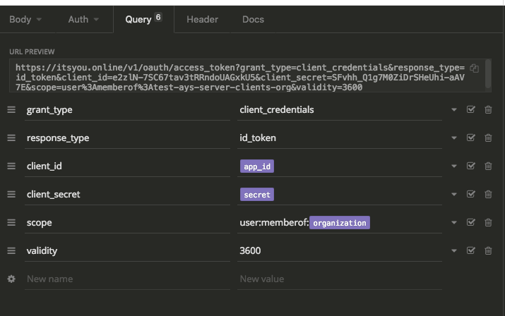

# Zero-Node

See first the steps as documented in [Using the JumpScale client for Zero-OS](14-zero-os_client.md)


Customer iPXE
https://bootstrap.gig.tech/ipxe/development/17d709436c5bc232/organization=zos-training-org%20development

Or using the unsecure bootstrap - since sometimes Packer refuses our SSL:
http://unsecure.bootstrap.gig.tech/ipxe/development/17d709436c5bc232/organization=zos-training-org%20development


JumpScale bootstrap VM:
- https://be-gen-1.demo.greenitglobe.com/CBGrid/Virtual%20Machine?id=2841
- `ssh root@195.134.212.38 -p7722`


See session of Zaibon:
https://www.youtube.com/edit?o=U&video_id=iOkYf3S7ol0

## Have a connection to your Zero-OS

If you have an existing one:
```python
j.clients.zero_os.list()
zos_instance_name = 'robot-training-node'
zos_client = j.clients.zero_os.get(instance=zos_instance_name)
zos_node = j.clients.zero_os.sal.get_node(instance=zos_instance_name)
```

In case you need to create a new one, let's first get I (new) **refreshable** JWT:
```python
iyo_organization = "zos-training-org"
iyo_client = j.clients.itsyouonline.get(instance='main')
memberof_scope = "user:memberof:{}".format(iyo_organization)
jwt = iyo_client.jwt_get(scope=memberof_scope, refreshable=True)
```

Then create a new config instance for the new node:
```python
zos_instance_name = 'robot-training-node2'
node_address = '10.147.18.32'
zos_cfg = {
   "host": node_address,
   "port": 6379,
   "password_": jwt
}

zos_client = j.clients.zero_os.get(instance=zos_instance_name, data=zos_cfg)
zos_node = j.clients.zero_os.sal.get_node(instance=zos_instance_name)
```

Or replace the last two lines with the following in order to update an existing configuration instance with a new JWT and IP address:
```python
zos_cfg_instance = j.tools.configmanager.get(location='j.clients.zero_os', instance=zos_instance_name)
zos_cfg_instance.data_set(key='password_', val=jwt, save=True)
zos_cfg_instance.data_set(key='host', val=node_address, save=True)
zos_client = j.clients.zero_os.get(instance=zos_instance_name)
#zos_client.ping()
zos_node = j.clients.zero_os.sal.get_node(instance=zos_instance_name)
```

## Using the Zero-Robot command line tool

Currently, in order to use the Zero-Robot command line option you need to have to full Zero-Robot repository on your machine:

Options:
- Zero-Robot is included in the sandbox - CHECK
- Zero-Robot can be added to a JumpScale installation using the prefab module for Zero-Robot
- Zero-Robot can be installed from the command line tool, see [Getting started with Zero-Robot](https://github.com/yveskerwyn/jumpscale/blob/master/12-zero-robot.md)


In order to have the most recent `development` branch bits:
```bash
cd /opt/code/github/jumpscale/core9
git pull
cd ../lib9
git pull
cd ../prefab9
git pull
```

In order to make sure that new modules that got introduced are available from the interactive shell:
```bash
js9_init
```

Start the interactive shell:
```python
js9
```

Install the Zero-Robot using the Prefab module for Zero-Robot:
```python
j.tools.prefab.local.zero_os.zos_robot.install(branch="development")
```

For old JumpScale installations, to reinstall psutil>=5.4.3, this in order to solve the JumpScale 9.3.0 requirement that PyYaml needs to be >=3.12:
```bash
#apt-get purge --auto-remove python-psutil
pip3 install —ignore-installed psutil>=5.4.3
```

Now from the command line you now create get start the `zrobot` tool:
```bash
zrobot --help
```

Getting the JWT from the command line:
```bash
APP_ID='<your client id>'
SECRET='<your secret>'
ORG="zos-training-org"
VALIDITY_IN_SECONDS=3600
JWT=`curl -s -X POST "https://itsyou.online/v1/oauth/access_token?grant_type=client_credentials&client_id=${APP_ID}&client_secret=${SECRET}&response_type=id_token&scope=user:memberof:${ORG}&validity=${VALIDITY_IN_SECONDS}"`
echo $JWT
```

First you need to connect, creating a configuration instance:
```bash
ZROBOT_ADDR=http://10.147.18.206:6600
ZROBOT_NAME="myrobot"
zrobot robot connect $ZROBOT_NAME $ZROBOT_ADDR $JWT
```

Check the currently connected robot:
```bash
zrobot robot current
```

Create a new tmux session:
``bash
tmux new -s zrobot
```

Split the screen using `CTRL+B` and then `"` `ENTER`

In the below pane let's show the output of your Zero-Robot by executing the following in the interactive shell:
```python
j.clients.zero_os.list()
zos_instance_name = 'robot-training-node'
#zos_client = j.clients.zero_os.get(instance=zos_instance_name)
zos_node = j.clients.zero_os.sal.get_node(instance=zos_instance_name)
zrobot_container = zos_node.containers.get(name='zrobot')

subscription = zrobot_container.client.subscribe(job='zrobot')
subscription.stream()
```

Now go to the upper pane in your TMUX session: `CTRL+B` and then `arrow up`

Now let's create a blueprint:
```bash
mkdir /opt/var/blueprints
cd /opt/var/blueprints
vim vm.yaml
```

Here's the blueprint for creating a virtual machine:
```yaml
services:
   - github.com/zero-os/0-templates/vm/0.0.1__vm1:
       flist: 'https://hub.gig.tech/gig-bootable/ubuntu-xenial-bootable-sshd.flist'
       memory: 256
       cpu: 1
       nics:
           - type: 'default'
       ports:
           - '23:22'

actions:
   - actions: ['install']
     service: vm1
```

Execute the blueprint:
```bash
cd /opt/var/blueprints
zrobot blueprint execute vm.yaml
```

Let's check the result:
```bash
zrobot service list
zrobot task get <service-id> <task-id>
```

### Using the Zero-Robot client

As a result of using the Zero-Robot command line tool (`zrobot`) a Zero-Robot configuration was created with the name as specified in the environment variable `$ZROBOT_NAME`, as you can check from JumpScale:
```python
j.clients.zrobot.list()
```

Get the client as follows:
```python
r = j.clients.zrobot.robots["myrobot3"]
r.services.names
vm = r.services.names['vm1']
type(vm) # => zerorobot.service_proxy.ServiceProxy
vm.actions
vm.state
task = vm.schedule_actions('enable_vnc')
task.action_name
task.state
task.duration
task.result
task.wait()
task = vm.schedule_actions('unisntall')
vm = r.services.names['vm1']
vm.delete()
r.services.names
```

```python
j.clients.zero_os.list()
robot_training_node = j.clients.zero_os.get(instance="robot-training-node")
```


Use the ZeroTier address!! No port forward needed in OVC.
Have your machine (Mac) joined in the ZT

Insomnia:
{
	"organization": "zos-training-org",
	"url": "http://10.147.18.206:6600"
}




Use the Zero-Robot client:

https://rawgit.com/zero-os/0-robot/master/api_spec/api.html

template = recipe
blueprint = order

https://github.com/zero-os/0-robot/tree/master/docs/services


https://zero-os.github.io/0-robot/api/zerorobot/dsl/ZeroRobotAPI.m.html


no pushing, fully stateless


Chris used a vnc client -> install one

Wallet

```bash
cat blockchain.yaml
```


```python
r = j.clients.zrobot.robots['robot1']
r.templates.uids
r.templates.add_repo('https://github.com/threefoldtoken/0-templates.git')
r.templates.uids
bc = .services.create('github.com/threefoldtoken/0-templates/block_creator/0.0.1', bc', {'node': 'local'})
bc.state
task = bc.schedule_action('install')
task.wait()
task.state
bc.state
task = bc.schedule_action('start')
task.wait()
task.state
bc.state
task = bc.schedule_action('wallet_amount')
task.state
task.result
task = bc.schedule_action('wallet_address')
task.result
task = bc.schedule_action('uninstall')
bc.delete()
r.services.names
```