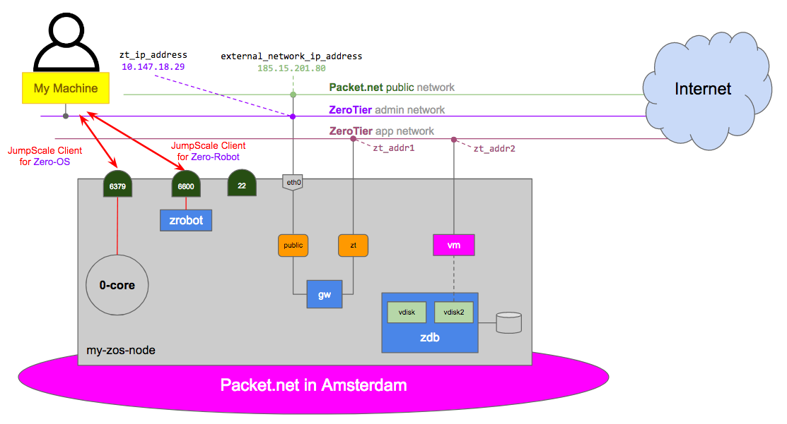

# Getting started with the Zero-OS Primitives on Packet.net

## Demo setup



## Demo steps

- [Create the ZeroTier network](#create-zt-network)
- [Join the ZeroTier network](#join-zt-network)
- [Get a Packet.net client](#packet-client)
- [Boot a Zero-OS node on Packet.net](#packet-boot)
- [Update the Zero-OS configuration instance](#zos-cfg)
- [Get the Zero-OS SAL interface](#zos-sal)
- [Authorize SSH access](#ssh)
- [Install the Zero-Robot Client](#install-zrobot)
- [Get a Zero-Robot Client](#zrobot-client)
- [Stream the Zero-Robot output](#stream)
- [Get the zrobot interface](#zrobot)
- [Create the node service](#node-service)
- [Create the network service](#network-service)
- [Create the ZeroTier service](#zt-service)
- [Create the gateway service](#gw-service)
- [Create virtual disk service](#vdisk-service)
- [Using the SAL](#sal)


<a id="create-zt-network"></a>

## Create the ZeroTier network

Install ZT if needed:
```python
j.tools.prefab.local.network.zerotier.install()
j.tools.prefab.local.network.zerotier.start()
```

List the configuration instances for your ZeroTier accounts:
```python
j.clients.zerotier.list()
```

Set the name of the ZeroTier configuration instance for the ZeroTier account you want to create or use:
```python
zt_config_instance_name = 'my_zt_account'
```

In case you have already created a configuration instance for your ZeroTier account just get it:
```python
zt_client = j.clients.zerotier.get(instance=zt_config_instance_name)
```

Optionally, in order to delete your existing ZeroTier configuration instance:
```python
j.clients.zerotier.delete(instance=zt_config_instance_name)
```

In case you need to create a (new) JumpScale client for ZeroTier:
```python
zt_token = '***'
zt_cfg = dict([('token_', zt_token)])
zt_client = j.clients.zerotier.get(instance=zt_config_instance_name , data=zt_cfg)
```

In order to list all your available ZeroTier networks:
```python
zt_client.networks_list()
```

Set the name of the ZeroTier network you want to use as your management network:
Create the network:
```python
zt_admin_network_name = 'admin_network'
```

If this ZeroTier network was already created before, get it using the network id:
```python
zt_admin_network_id = '9f77fc393eb910bc'
zt_admin_network = zt_client.network_get(network_id=zt_admin_network_id)
```

If not created yet the network, create it:
```python
auto_assign_range = '10.147.19.0/24'
zt_admin_network = zt_client.network_create(public=False, name=zt_admin_network_name, auto_assign=True, subnet=auto_assign_range)
zt_admin_network_id = zt_admin_network.id
```

Check the result:
```python
zt_admin_network = zt_client.network_get(network_id=zt_admin_network_id)
zt_admin_network.config
```

<a id="join-zt-network"></a>

## Join the ZeroTier network

Join:
```python
j.tools.prefab.local.network.zerotier.network_join(network_id=zt_admin_network_id)
```

Authorize the join request:
```python
zt_machine_addr = j.tools.prefab.local.network.zerotier.get_zerotier_machine_address()

zos_member = zt_admin_network.member_get(address=zt_machine_addr)
zos_member.authorize()
```

<a id = 'packet-client'></a>

## Get a Packet.net client

In what follows we will boot a Zero-OS on a physical machine one Packet.net - instead of using the virtual machine running on OpenvCloud as documented above.

Check for existing Packet.net clients:
```python
j.clients.packetnet.list()
```

Set the name of the Packet.net configuration instance you want to use/create:
```python
packet_cfg_instance_name = 'my_packet_account'
```

In case you already created the Packet.net client previously, get it:
```python
packet_client = j.clients.packetnet.get(instance=packet_cfg_instance_name, create=False, interactive=False)
```

If not, create the client:
```python
packet_api_key = '...'
packet_project_name = 'GIG Engineering'
packet_cfg = dict(auth_token_=packet_api_key, project_name=packet_project_name)
packet_client = j.clients.packetnet.get(instance=packet_cfg_instance_name, data=packet_cfg, interactive=False)
```


<a id = 'packet-boot'></a>

## Boot a Zero-OS node on Packet.net

Boot a VM with Zero-OS in the cloud space:
```python
iyo_organization = 'zos-training-org'
zos_kernel_params = ['organization={}'.format(iyo_organization), 'development', 'console=ttyS1,115200']
#zos_branch = 'v1.2.2'
zos_branch = 'development'

zos_hostname = 'my-zos-node'
zt_token = '...'
#zt_admin_network_id = '9f77fc393e7fd8b4'
zos_client, node, zt_ip_address = packet_client.startZeroOS(hostname=zos_hostname, plan='t1.small', facility='ams1', zerotierId=zt_admin_network_id, zerotierAPI=zt_token, wait=True, remove=False, params=zos_kernel_params, branch=zos_branch)
```

`packet_client.startZeroOS()` calls `packet_client.startDevice()`, which you can alternatively use if you prefer to pass the iPXE URL and authorize the join request explicitly:
```python
#ipxe_url = 'ipxe: https://bootstrap.gig.tech/ipxe/{}/{}/'.format(zos_branch, zt_admin_network_id) + '%20'.join(zos_kernel_params)
ipxe_url = 'ipxe: http://unsecure.bootstrap.gig.tech/ipxe/{}/{}/'.format(zos_branch, zt_admin_network_id) + '%20'.join(zos_kernel_params)

node = packet_client.startDevice(hostname=zos_hostname, plan='x1.small', facility='ams1', os='Custom iPXE', ipxeUrl=ipxe_url, wait=True, remove=False, sshkey=sshkey_name)
```

Get the ID of the newly created device:
```python
packet_device = packet_client.getDevice(name=zos_hostname)
packet_device_id = packet_device.id
import os
os.environ.putenv('device_id', packet_device_id)
```

Check to output from Zero-OS console:
```bash
ssh $device_id@sos.ams1.packet.net
```

Using `packet_client.startZeroOS()` also implicitly creates and returns Zero-OS client, of which the configuration instance name is set to ZeroTier IP address:
```python
j.clients.zos.list()
#zos_instance_name = zt_ip_address
#zos_client = j.clients.zos.get(instance=zos_instance_name, create=False, interactive=False)
```

<a id='zos-cfg'></a>

## Update the Zero-OS configuration instance 

Checking the configuration instance data will reveal (bug) that the JWT was not set correctly:
```python
zos_client.config.data['password_']
```

In order to set it:
```python
iyo_client = j.clients.itsyouonline.get(instance='main')
memberof_scope = 'user:memberof:{}'.format(iyo_organization)
jwt = iyo_client.jwt_get(scope=memberof_scope, refreshable=True)
zos_client.config.data_set(key='password_', val=jwt)
```

<a id='zos-sal'></a>

## Get the Zero-OS SAL interface 

In order to access the Zero-OS node interface, and list all containers:
```python
zos_sal = j.clients.zos.sal.get_node(instance=zos_client.instance)
#zos_sal = j.clients.zos.sal.get_node(instance=zt_ip_address)
zos_sal.containers.list()
```

Check the version:
```python
zos_sal.client.info.version()
```

<a id='ssh'></a>

## Authorize SSH access 

Execute:
```python
sshkey_name = 'my_sshkey'
sshkey_path = "/root/.ssh/{}".format(sshkey_name)
sshkey_client = j.clients.sshkey.get(sshkey_name)
pubkey = sshkey_client.pubkey
zos_sal.client.bash('echo "{}" >> /root/.ssh/authorized_keys'.format(pubkey)).get()
```

<a id='instal-zrobot'></a>

## Install the Zero-Robot Client

Exit the interactive shell and make sure all (core9, lib9, prefab9) JumpScale repositories are update to date, and for each of them do the installation:
```bash
git pull
pip3 install -e . 
```

Or from the interactive shell:
```python
j.tools.prefab.local.tools.git.pullRepo('https://github.com/Jumpscale/core9.git')
j.tools.prefab.local.tools.git.pullRepo('https://github.com/Jumpscale/lib9.git')
j.tools.prefab.local.tools.git.pullRepo('https://github.com/Jumpscale/prefab9.git')
j.tools.prefab.local.js9.js9core.install(reset=False, branch='development', full=False)
```

Then get again into the interactive shell to clone the Zero-Robot repository and install the Zero-Robot:
```python 
j.tools.prefab.local.tools.git.pullRepo(url='git@github.com:zero-os/0-robot.git')
j.tools.prefab.local.zero_os.zos_robot.install(branch="development", reset=True)
```

Once more exit the interactive shell and restart, as a result you will now have the Zero-Robot client available:
```python
j.clients.zrobot.list()
```

<a id='zrobot-client'></a>

## Get a Zero-Robot Client

Create Zero-Robot client:
```python
zrobot_instance_name = 'my_robot'
#zrobot_cfg = dict(url=zt_ip_address, jwt_=jwt)
zrobot_url = 'http://{}:6600'.format(zos_sal.addr)
zrobot_cfg = dict(url=zrobot_url, jwt_=jwt)

zrobot_client = j.clients.zrobot.get(instance=zrobot_instance_name, data=zrobot_cfg)
#zrobot_client = j.clients.zrobot.get(instance=zrobot_instance_name)
```

<a id='stream'></a>

## Stream the Zero-Robot output

Stream the Zero-Robot output - in another JumpScale interactive shell:
```python
j.clients.zos.list()
zos_instance_name = '10.147.19.53'
zos_sal = j.clients.zos.sal.get_node(instance=zos_instance_name)
zrobot_container = zos_sal.containers.get(name='zrobot')

subscription = zrobot_container.client.subscribe(job='zrobot')
subscription.stream()
```

Check the version of the Zero-Robot on the node:
```python
zos_sal.containers.get('zrobot').info
```

<a id='zrobot'></a>

## Get the zrobot interface

Get the `zrobot` interface:
```python
zrobot = j.clients.zrobot.robots[zrobot_instance_name]
```

```python
NODE_UID = 'github.com/zero-os/0-templates/node/0.0.1'
ZT_UID = 'github.com/zero-os/0-templates/zerotier_client/0.0.1'
NETWORK_UID = 'github.com/zero-os/0-templates/network/0.0.1'
VDISK_UID = 'github.com/zero-os/0-templates/vdisk/0.0.1'
VM_UID = 'github.com/zero-os/0-templates/vm/0.0.1'
GW_UID = 'github.com/zero-os/0-templates/gateway/0.0.1'
```

<a id='node-service'></a>

## Create the node service

Let's first create a [node service](https://github.com/zero-os/0-templates/tree/master/templates/node).

Node service:
```python
node_data = {
        'hostname': 'myzos'
    }

node_service = zrobot.services.find_or_create(template_uid=NODE_UID, service_name='my_packet_node_service', data=node_data) 
node_service.schedule_action('install').wait(die=True)
```

<a id='network-service'></a>

## Create the network service

Network service - only needed when using VLAN and/or VXLAN network:
```python
network_data = {
    'vlanTag': 2312,
    'cidr': '10.210.0.0',
    'bonded': False
    }

network_service = zrobot.services.find_or_create(NETWORK_UID, service_name='my_network', data=network_data) 
```

Use the network service to configure the network:
```python
data = {'node_name': 'local'}
network_service.schedule_action('configure', data).wait(die=True)
```

<a id='zt-service'></a>

## Create the ZeroTier service

Create a ZeroTier service:
```python
zt_data = {'token': zt_token}
zt_service_name = 'my_zt_service'
zt_service = zrobot.services.find_or_create(template_uid=ZT_UID, service_name=zt_service_name, data=zt_data)
```


<a id='gw-service'></a>

## Create the gateway service


Let's quickly, explicitly create a ZT network:
```python
zt_app_network_name = 'app_network'
auto_assign_range2 = '10.147.20.0/24'
zt_app_network = zt_client.network_create(public=False, name=zt_app_network_name, auto_assign=True, subnet=auto_assign_range2)
zt_app_network_id = zt_app_network.id
zt_app_network_id = 'c7c8172af144c172'
```


Define a gateway with a `default` public network, and a private `zerotier` network:

```python
gw_data = {
    'hostname': 'mygw',
    'domain': 'lan',
    'networks': [
        {
        'name': 'public',
        'type': 'default',
        }, 
        {
        'name': 'private',
        'type': 'zerotier',
        'id': zt_app_network_id,
        'ztClient' : zt_service_name
         }]
    }
```

Create the gateway service:
```python
gw_service = zrobot.services.find_or_create(template_uid=GW_UID, service_name='mygw', data=gw_data)
gw_service.schedule_action('install').wait(die=True)
```


<a id='vdisk-service'></a>

## Create virtual disk service


Virtual disk service:
```python
vdisk_data = {
        'size': 10,
        'diskType': 'HDD',
        'mountPoint': '/mnt',
        'filesystem': 'ext4',
    }
vdisk_service = zrobot.services.create(VDISK_UID, service_name='mydisk', data=vdisk_data)
vdisk_service.schedule_action('install').wait(die=True)
```

Use the vdisk service to get the private URL of the virtual disk
```python
privateurl = vdiskservice.schedule_action('private_url').wait(die=True).result

```


<a id='using-sal'></a>

## Using the SAL

In case of a Packet.net machine we cannot add an additional external/public network interface, we only get the one set by Packet.net:
```python
node.pubconfig['netinfo'][0]['address'] 
```

Let's create a gateway:
```python
gw_name3 = "my-gw3"
gw3 = zos_sal.primitives.create_gateway(name=gw_name3)
```

Because the public interface assigned by Packet.net is already in use by Zero-OS itself, we can not use it directly in the gateway but instead we use the internal NATting feature of Zero-OS and forward all ports needed by the gateway from the Zero-OS.
```python
public_net = gw3.networks.add(name='public', type_='default')
```

Define the ZeroTier private network:
```python
zt_client = j.clients.zerotier.get(instance=zt_config_instance_name)
zt_app_network_name = 'app_network'
zt_private_network = gw3.networks.add_zerotier(network=zt_client, name=zt_app_network_name)
```

The above will result in the gateway creating the ZeroTier network, in case you want to create the ZeroTier network yourself/explicitly:
```python
zt_client = j.clients.zerotier.get(instance=zt_config_instance_name)
zt_app_network_name = 'app_network'
auto_assign_range2 = '10.147.20.0/24'
zt_app_network = zt_client.network_create(public=False, name=zt_app_network_name , auto_assign=True, subnet=auto_assign_range2)
zt_private_network = gw3.networks.add_zerotier(network=zt_app_network)
```

Set a nameserver:
```python
zt_private_network.hosts.nameservers = ['1.1.1.1']
```

Deploy the gateway:
```python
gw3.deploy()
```