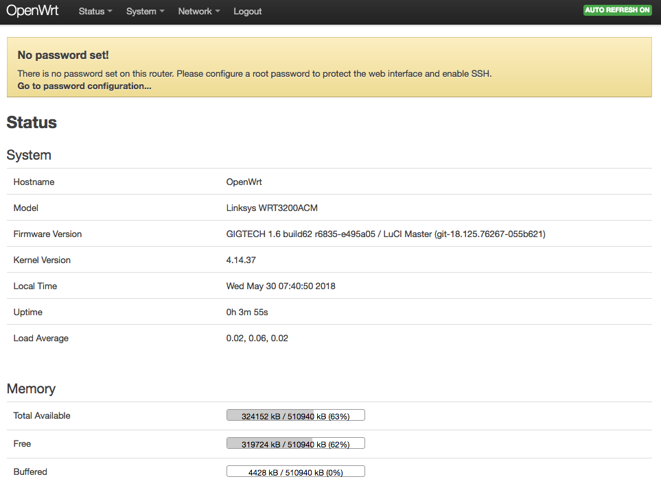

# Zero-Boot

https://github.com/zero-os/0-boot-templates

- [Dependencies](#dependencies)
- [Install OpenWRT on your router](#install-openwrt)
- [Set router password](#set-password)
- [Update firewall of router](fw-rules)
- [Create the ZeroTier network](#create-zt)
- [Join the ZeroTier network](#join-zt)
- [Install an configure the Zero-Boot server on your OpenWRT router](#zboot-server)
- [Get a Zero-Boot Client](#zboot-client)
- [Assign a static host address to the Racktivity PDU](#add-racktivity)
- [Get Racktivity client for the PDU](#racktivity-client)


<a id='dependencies'></a>
## Depenencies

```bash
pip3 install pyghmi
```

<a id='install-openwrt'></a>
## Install OpenWRT on your router

This step requires a direct LAN connection to your OpenWRT device.

See: https://github.com/Jumpscale/prefab9/blob/development/docs/prefab.zeroboot.md


Installing OpenWRT on a brand new router:

    Download the correct factory image from http://lede.gig.tech/targets/mvebu/cortexa9/ depending on your router model.
    Go to Router Settings > Configuration > Manual file and choose the OpenWrt image. It will take around 5 mins to load OpenWrt, then It will restart the router.


<a id='set-password'></a>

## Set router password

Go to http://192.168.1.1




Go to **System | Administration**:


Set the password:


Click **Save & Apply**.


<a id='fw-rules'></a>

## Update firewall of router

Skip - not needed.


SSH rule:


HTTPS rule:


<a id='create-zt'></a>

## Create the ZeroTier network

Install ZT if needed:
```python
j.tools.prefab.local.network.zerotier.install()
j.tools.prefab.local.network.zerotier.start()
```

List the configuration instances for your ZeroTier accounts:
```python
j.clients.zerotier.list()
```

Set the name of the ZeroTier configuration instance for the ZeroTier account you want to create or use:
```python
zt_config_instance_name = 'my_zt_account'
```

In case you have already created a configuration instance for your ZeroTier account just get it:
```python
zt_client = j.clients.zerotier.get(instance=zt_config_instance_name)
```

Optionally, in order to delete your existing ZeroTier configuration instance:
```python
j.clients.zerotier.delete(instance=zt_config_instance_name)
```

In case you need to create a (new) JumpScale client for ZeroTier:
```python
zt_token = '***'
zt_cfg = dict([('token_', zt_token)])
zt_client = j.clients.zerotier.get(instance=zt_config_instance_name , data=zt_cfg)
```

In order to list all your available ZeroTier networks:
```python
zt_client.networks_list()
```

Set the name of the ZeroTier network you want to use as your zero-boot network:
```python
zt_zboot_network_name = 'zboot network'
```

If this ZeroTier network was already created before, get it using the network id:
```python
zt_zboot_network_id = '9f77fc393e4d89ef'
zt_zboot_network = zt_client.network_get(network_id=zt_zboot_network_id)
```

If not created yet the network, create it:
```python
auto_assign_range = '10.147.20.0/24'
zt_zboot_network = zt_client.network_create(public=False, name=zt_zboot_network_name, auto_assign=True, subnet=auto_assign_range)
zt_zboot_network_id = zt_zboot_network.id
```

<a id='join-zt'></a>

## Join the ZeroTier network

Join:
```python
j.tools.prefab.local.network.zerotier.network_join(network_id=zt_zboot_network_id)
```

Authorize the join request:
```python
zt_machine_addr = j.tools.prefab.local.network.zerotier.get_zerotier_machine_address()

zos_member = zt_zboot_network.member_get(address=zt_machine_addr)
zos_member.authorize()
```

<a id='#zboot-server'></a>

## Install an configure the Zero-Boot server on your OpenWRT router

First get an SSH connection to your OpenWRT router:
```python
router_addr = '192.168.1.1'
ssh_client_instance_name = 'router'
ssh_client_cfg = dict(addr=router_addr, login='root', passwd_='rooter')
ssh_client = j.clients.ssh.get(instance=ssh_client_instance_name, data=ssh_client_cfg)
```

Install the `bash`, `openssh-sftp-server`, `openssl-util,` `coreutils-base64` and `tmux` on the router:
```python
ssh_client.execute(cmd="opkg update")
ssh_client.execute(cmd="opkg install bash openssh-sftp-server openssl-util coreutils-base64 tmux")
```

Use the Zero-Boot prefab module to install and configure the Zero-Boot server:
```python
prefab = ssh_client.prefab
prefab.network.zeroboot.install(network_id=zboot_zt_network_id, token=zt_token)
```


Now (physically) disconnect from the direct connection with your OpenWRT router and reconnect over the ZeroTier network:
```python
router_zt_addr = '172.28.29.97'
ssh_client_instance_name2 = 'router_zt'
ssh_client_cfg2 = dict(addr=router_zt_addr, login='root', passwd_='rooter')
ssh_client = j.clients.ssh.get(instance=ssh_client_instance_name2, data=ssh_client_cfg2)
```


Verify the ZeroTier network, where you see:
- the ZeroTier IP address that was assigned to your OpenWRT router
- the managed route for `192.168.1.0/24` that got added


Also see: https://github.com/Jumpscale/prefab9/blob/development/docs/prefab.zeroboot.md


<a id='#zboot-client'></a>

## Get a Zero-Boot Client

Get a client for your Zero-Boot server, make sure to specify the ZT configuration of your OpenWRT router:
```python
zboot_instance_name = 'my_zboot'
zboot_cfg = dict(sshclient_instance=ssh_client_instance_name2, zerotier_instance=zt_config_instance_name, network_id=zt_zboot_network_id)
zboot_client = j.clients.zboot.get(instance=zboot_instance_name, data=zboot_cfg)
#zboot_client = j.clients.zboot.get(instance=zboot_instance_name)

zboot_client.config
zboot_client.networks.list()
zboot_client.networks.get?
nw = zboot_client.networks.get('192.168.1.1/24')
nw.hosts.add?
host = nw.hosts.add(mac='88:91:DD:00:0F:1D', '192.168.1.100', 'racktivity')
host = nw.hosts.add('88:91:DD:00:0F:1D', '192.168.1.100', 'racktivity')
```


<a id='#add-racktivity'></a>

## Assign a static host address to the Racktivity PDU


Connect the Racktivity PDU to the OpenWRT router. As a result the PDU wil a dynamic IP address from the DHCP server; on the router see **DHCP Leases** under **Status | Overview**.

In order to make this a static IP address execute:
```python
racktivity_mac_addr = '88:91:DD:00:0F:1D'
racktivity_ip_addr = '192.168.1.100'
racktivity_hostname = 'rack1'
lan_network = zboot_client.networks.get(subnet='192.168.1.1/24')
racktivity = lan_network.hosts.add(mac=racktivity_mac_addr, address=racktivity_ip_addr, hostname=racktivity_hostname)
```


<a id='#racktivity-client'></a>


## Get Racktivity client for the PDU

```python
rack_instance_name = racktivity_hostname
rack_cfg = dict(hostname=racktivity_ip_addr, port=80, username='admin', password_='1234')
rack_client = j.clients.racktivity.get(instance=rack_instance_name, data=rack_cfg)
```


## IPMI client


```python
ipmi_cfg = dict('bmc'=bmc, 'user'=user, 'password'=password, 'port'=623)
j.clients.ipmi.get(instance=self.name, data=ipmi_cfg, interactive=False)
```


